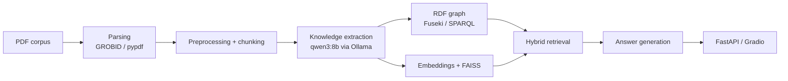

# RDFRAG VKR

Гибридная `graph + vector RAG`-система для корпуса научных PDF-документов по цифровой экономике и смежным технологическим направлениям.

Репозиторий содержит прототип дипломного проекта, который объединяет:
- парсинг научных PDF через `GROBID -> pypdf fallback`
- preprocessing и chunking
- извлечение знаний с использованием LLM
- построение RDF-графа знаний
- графовый retrieval через `Apache Jena Fuseki / SPARQL`
- векторный retrieval через `FAISS`
- гибридное объединение результатов и reranking
- генерацию ответов через `Ollama + qwen3:8b`
- API на `FastAPI` и чат-интерфейс на `Gradio`

## Ключевые характеристики

- `151` научный PDF-документ в рабочем корпусе
- `5135` текстовых chunks после preprocessing
- hybrid retrieval в трёх режимах: graph baseline, vector tuned mode, graph+vector hybrid mode
- evaluation по метрикам `HitRate@K`, `Precision@K`, `Recall@K`, `MRR@K`, `nDCG@K`
- готовые визуализации и отчёты для ВКР

## Архитектура



## Технологический стек

- Python
- FastAPI
- Gradio
- Apache Jena Fuseki
- rdflib
- FAISS
- Ollama
- qwen3:8b
- deepvk/USER-base

## Структура репозитория

```text
data/
  eval/            входные данные и отчёты evaluation
  rdf/             RDF-граф и артефакты извлечённых знаний
artifacts/
  metrics/         CSV и JSON результаты evaluation
  plots/           сгенерированные графики и визуализации
  reports/         markdown и HTML-отчёты
scripts/           скрипты ingestion, upload, evaluation и генерации визуализаций
src/rdfrag_vkr/    исходный код
tests/             тесты
```

## Быстрый старт

Установка:

```bash
pip install -e .
```

Запуск ingestion:

```bash
python scripts/run_ingestion.py
```

Загрузка RDF в Fuseki:

```bash
python scripts/upload_rdf.py
```

Запуск evaluation:

```bash
python scripts/run_evaluation.py
```

Запуск API:

```bash
python main.py --mode api --host 0.0.0.0 --port 8000
```

Запуск Gradio UI:

```bash
python main.py
```

## Результаты retrieval

| Режим | HitRate@5 | Precision@5 | Recall@5 | MRR@5 | nDCG@5 |
| --- | ---: | ---: | ---: | ---: | ---: |
| Graph baseline | 0.60 | 0.26 | 0.5667 | 0.55 | 0.5631 |
| Vector tuned | 1.00 | 0.30 | 0.6667 | 0.6667 | 0.7524 |
| Hybrid | 0.90 | 0.36 | 0.80 | 0.725 | 0.7693 |

Гибридный режим показывает наилучшее качество ранжирования в целом и лучший recall на текущем наборе gold-запросов.

## Что уже включено в репозиторий

В репозитории уже присутствуют:
- evaluation-метрики и отчёты
- графики и иллюстрации для ВКР
- graph visualizations
- RDF-артефакты
- таблицы с demo queries

## Что исключено из Git

Тяжёлые локальные данные намеренно исключены из репозитория:
- raw PDFs
- parsed outputs
- chunk dumps
- embedding storage

Это позволяет сохранить репозиторий компактным, оставив при этом код, evaluation-результаты, RDF-артефакты и визуальные материалы.

## Цель проекта

Цель проекта — построить практическую `graph-enhanced Retrieval-Augmented Generation`-систему, которая повышает обоснованность ответов за счёт сочетания семантического векторного поиска и retrieval по явно заданному графу знаний.
