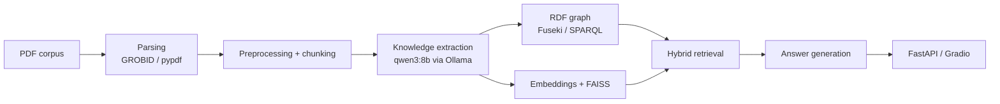

# RDFRAG VKR

Hybrid `graph + vector RAG` system for scientific PDF collections in digital economy and related technology domains.

This repository contains a diploma project prototype that combines:
- scientific PDF parsing with `GROBID -> pypdf fallback`
- preprocessing and chunking
- LLM-based knowledge extraction
- RDF knowledge graph construction
- graph retrieval via `Apache Jena Fuseki / SPARQL`
- vector retrieval via `FAISS`
- hybrid fusion and reranking
- answer generation with `Ollama + qwen3:8b`
- `FastAPI` API and `Gradio` chat UI

## Highlights

- `151` scientific PDF documents in the working corpus
- `5135` text chunks after preprocessing
- hybrid retrieval: graph baseline, vector tuned mode, graph+vector hybrid mode
- evaluation with `HitRate@K`, `Precision@K`, `Recall@K`, `MRR@K`, `nDCG@K`
- generated diploma-ready visualizations and reports

## Architecture



## Tech Stack

- Python
- FastAPI
- Gradio
- Apache Jena Fuseki
- rdflib
- FAISS
- Ollama
- qwen3:8b
- deepvk/USER-base

## Repository Structure

```text
data/
  eval/            evaluation inputs and reports
  rdf/             RDF graph and knowledge artifacts
artifacts/
  metrics/         CSV and JSON evaluation outputs
  plots/           generated figures and visualizations
  reports/         markdown and HTML reports
scripts/           ingestion, upload, evaluation, visualization scripts
src/rdfrag_vkr/    source code
tests/             test suite
```

## Quick Start

Install:

```bash
pip install -e .
```

Run ingestion:

```bash
python scripts/run_ingestion.py
```

Upload RDF to Fuseki:

```bash
python scripts/upload_rdf.py
```

Run evaluation:

```bash
python scripts/run_evaluation.py
```

Start API:

```bash
python main.py --mode api --host 0.0.0.0 --port 8000
```

Start Gradio UI:

```bash
python main.py
```

## Retrieval Results

| Mode | HitRate@5 | Precision@5 | Recall@5 | MRR@5 | nDCG@5 |
| --- | ---: | ---: | ---: | ---: | ---: |
| Graph baseline | 0.60 | 0.26 | 0.5667 | 0.55 | 0.5631 |
| Vector tuned | 1.00 | 0.30 | 0.6667 | 0.6667 | 0.7524 |
| Hybrid | 0.90 | 0.36 | 0.80 | 0.725 | 0.7693 |

The hybrid mode provides the strongest overall ranking quality and the best recall on the current gold-query evaluation set.

## Included Artifacts

This repository already contains:
- evaluation metrics and reports
- diploma figures and plots
- graph visualizations
- RDF artifacts
- demo query tables

## Excluded from Git

Heavy local data is intentionally excluded from the repository:
- raw PDFs
- parsed outputs
- chunk dumps
- embedding storage

This keeps the repository compact while preserving the code, evaluation outputs, RDF artifacts, and visual materials.

## Project Goal

The goal of the project is to build a practical `graph-enhanced Retrieval-Augmented Generation` system that improves answer grounding by combining semantic vector search with explicit graph-structured knowledge retrieval.
